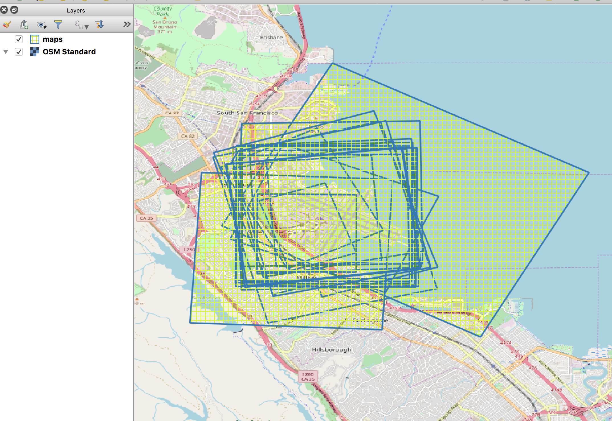

# sfomuseum-data-maps

Maps related to the SFO Museum collection.

## Important

This is work in progress and not properly documented yet.

## Maps

| URI | WOF ID | Inception | Cessation | Min Zoom | Max Zoom |
| --- | --- | --- | --- | --- | --- |
| 1937 | [1477881739](data/147/788/173/9/1477881739.geojson) | 1937 | 1937 | 12 | 17 |
| 1941 | [1477881741](data/147/788/174/1/1477881741.geojson) | 1941 | 1941 | 13 | 18 |
| 1943 | [1360391321](data/136/039/132/1/1360391321.geojson) | 1943~ | 1943~ | 12 | 15 |
| 1946 | [1360391311](data/136/039/131/1/1360391311.geojson) | 1946-07-29 | 1946-07-29 | 11 | 16 |
| 1947 | [1360391325](data/136/039/132/5/1360391325.geojson) | 1947~ | 1947~ | 11 | 15 |
| 1950 | [1360391333](data/136/039/133/3/1360391333.geojson) | 1950~ | 1950~ | 12 | 15 |
| 1956 | [1360391331](data/136/039/133/1/1360391331.geojson) | 1956-09-08 | 1956-09-08 | 11 | 16 |
| 1960 | [1360391323](data/136/039/132/3/1360391323.geojson) | 1960~ | 1960~ | 12 | 16 |
| 1965 | [1360391359](data/136/039/135/9/1360391359.geojson) | 1965-11-05 | 1965-11-05 | 12 | 17 |
| 1970 | [1360391347](data/136/039/134/7/1360391347.geojson) | 1970~ | 1970~ | 11 | 15 |
| 1972 | [1360391345](data/136/039/134/5/1360391345.geojson) | 1972-06-29 | 1972-06-29 | 11 | 15 |
| 1978 | [1360391339](data/136/039/133/9/1360391339.geojson) | 1978-01-24 | 1978-01-24 | 12 | 17 |
| 1980 | [1360391315](data/136/039/131/5/1360391315.geojson) | 1980-04-11 | 1980-04-11 | 12 | 17 |
| 1981 | [1360391317](data/136/039/131/7/1360391317.geojson) | 1981~ | 1981~ | 12 | 17 |
| 1985 | [1360391313](data/136/039/131/3/1360391313.geojson) | 1985~ | 1985~ | 13 | 18 |
| 1988 | [1360391327](data/136/039/132/7/1360391327.geojson) | 1988-09-26 | 1988-09-26 | 12 | 17 |
| 1989 | [1360391329](data/136/039/132/9/1360391329.geojson) | 1989-06-21 | 1989-06-21 | 12 | 17 |
| 1997 | [1360391335](data/136/039/133/5/1360391335.geojson) | 1997~ | 1997~ | 12 | 17 |
| 1998 | [1360391343](data/136/039/134/3/1360391343.geojson) | 1998~ | 1998~ | 12 | 17 |
| 1999 | [1360391341](data/136/039/134/1/1360391341.geojson) | 1999~ | 1999~ | 12 | 15 |
| 2000 | [1360391351](data/136/039/135/1/1360391351.geojson) | 2000~ | 2000~ | 12 | 17 |
| 2002 | [1360391349](data/136/039/134/9/1360391349.geojson) | 2002~ | 2002~ | 11 | 16 |
| 2004 | [1360391357](data/136/039/135/7/1360391357.geojson) | 2004~ | 2004~ | 12 | 17 |
| 2006 | [1360391353](data/136/039/135/3/1360391353.geojson) | 2006~ | 2006~ | 11 | 16 |
| 2010 | [1477881743](data/147/788/174/3/1477881743.geojson) | 2010 | 2010 | 12 | 19 |
| 2012 | [1477881745](data/147/788/174/5/1477881745.geojson) | 2012 | 2012 | 12 | 19 |
| 2013 | [1477881749](data/147/788/174/9/1477881749.geojson) | 2013 | 2013 | 12 | 17 |
| 2014 | [1477881751](data/147/788/175/1/1477881751.geojson) | 2014 | 2014 | 12 | 17 |
| 2015 | [1477881753](data/147/788/175/3/1477881753.geojson) | 2015 | 2015 | 12 | 20 |
| 2016 | [1477881755](data/147/788/175/5/1477881755.geojson) | 2016 | 2016 | 12 | 20 |
| 2017 | [1477881757](data/147/788/175/7/1477881757.geojson) | 2017 | 2017 | 12 | 20 |
| 2018 | [1477881759](data/147/788/175/9/1477881759.geojson) | 2018 | 2018 | 12 | 20 |

_This table was generated by the [utils/python/lookup_md.py](utils/python/lookup_md.py) tool._

## See also

* https://millsfield.sfomuseum.org/map/
